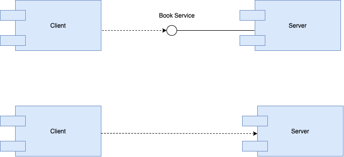
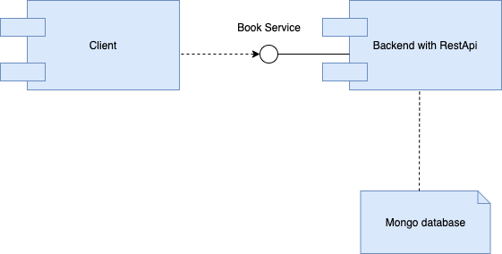
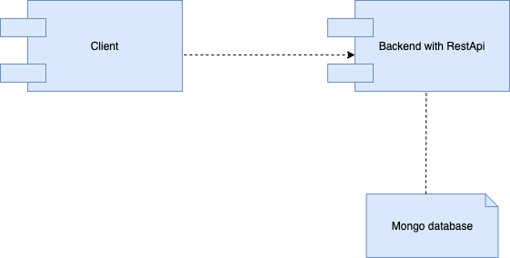

# softarch-hansaa-assignment-1

### Members

6031035821 Budsakorn Khosagrid  
6030097521 Janejira Aroonnual  
6030090021 Chirapa Peisiripatana  
6031036421 Palmmanee Thapphachaya  
6031038721 Prawsang Chayakulkeeree

## Contents

This contains the source code for REST api, client for the REST api, gRPC, and gRPC's client for a book record service. The directories and described below:

1. /gRPC - Contains both the client and server with gRPC
2. /rest - Contains both the client and server with RESTful APIs

## Screenshots of Swagger


## Source Code of REST API

#### Client

##### List All Books

```
const listAllBooks = () => {
  const listAllBooksAPI = async () => {
    await axios.get(`${BASE_URL}/books`).then((res) => console.log(res.data));
  };
  listAllBooksAPI();
};
```

##### Get a Book by ID

```
const getBookById = (id) => {
  const getBookByIdAPI = async (id) => {
    await axios
      .get(`${BASE_URL}/books/${id}`)
      .then((res) => console.log(res.data));
  };
  getBookByIdAPI(id);
};
```

##### Insert a Book

```
const insertBook = (id, title, author) => {
  const insertBookAPI = async (id, title, author) => {
    await axios
      .post(`${BASE_URL}/books`, {
        id,
        title,
        author,
      })
      .then((res) => console.log(res.data));
  };
  insertBookAPI(id, title, author);
};
```

##### Delete a Book

```
const deleteBookById = (id) => {
  const deleteBookByIdAPI = async (id) => {
    await axios
      .delete(`${BASE_URL}/books/${id}`)
      .then((res) => console.log(res.data));
  };
  deleteBookByIdAPI(id);
};
```

#### Server

```
const express = require("express");
const router = express.Router();
const { body } = require("express-validator");
const Book = require("../models/Book");

router.get("/", async (req, res) => {
  try {
    const books = await Book.find();
    res.json(books);
  } catch (err) {
    res.status(500).json({ errors: err });
  }
});

router.get("/:id", async (req, res) => {
  Book.findOne({ id: req.params.id })
    .then((book) => {
      res.status(200).json(book);
    })
    .catch((err) => {
      res.status(400).json({ errors: err });
    });
});

router.post(
  "/",
  [body("name").notEmpty(), body("author").notEmpty()],
  async (req, res) => {
    const book = new Book({
      name: req.body.name,
      author: req.body.author,
    });

    try {
      const newBook = await book.save();
      res.status(201).json(newBook);
    } catch (err) {
      res.status(400).json({ errors: err });
    }
  }
);

router.delete("/:id", async (req, res) => {
  try {
    await Book.findByIdAndDelete(req.params.id);
    res.status(200).json(true);
  } catch (err) {
    res.status(400).json({ errors: err });
  }
});

module.exports = router;
```

## Comparision between calling the methods based on gRPC and REST API

| Functions      | gRPC                                                         | Rest                                                       |
| -------------- | :----------------------------------------------------------- | :--------------------------------------------------------- |
| List All Books | `client.list({}, function(error, books) {printResponse(error, books);});`| `` axios.get(`${BASE_URL}/books`).then((res) => console.log(res.data));}; ``|
| Get One Book   | `client.get({ id: parseInt(id) }, function(error, book) {printResponse(error, book);});`| `` axios.get(`${BASE_URL}/books/${id}`).then((res) => console.log(res.data));}; ``|
| Add a Book     | `client.insert(book, function(error, empty) {printResponse(error, empty);});`| `` axios.post(`${BASE_URL}/books`, {id,title,author,}).then((res) => console.log(res.data));}; `` |
| Remove a Book  | `client.delete({ id: parseInt(id) }, function(error, empty) {printResponse(error, empty);});` | `` axios.delete(`${BASE_URL}/books/${id}`).then((res) => console.log(res.data));}; ``|

## Main differences between REST API and gRPC

Overall, the efficiency of gRPC is higher than that of REST due to several differences in their feature implementations such as protocol (HTTP2 vs HTTP1.1), payload(Protobuf vs JSON), API contract (Strict vs Loose)etc. However, for specific cases in which browser support is mandatory or only small payloads are required to be sent through multiple, simultaneous client-server calls, REST outperforms gRPC.

## Benefits of introduce interface in front of the gRPC and REST API of the book services
Introducing an interface allows for a service to be called without the need to know the specifics of the function that is connected to it. Interface also allows a service to be called via its original method name even when there is a change in server.

## Comparision between calling the methods based on gRPC and REST API based on the introduced interface

| Functions | gRPC | Rest |
| ------------- |:-------------| :-----|
| List All Books|`node client.js list`|`node client.js list`|
| Get One Book |`node client.js get [id]`|`node client.js get [id]`|
| Add a Book |`node client.js insert [id] [title] [author]`|`node client.js insert [id] [title] [author]`|
| Remove a Book |`node client.js delete [id]` |`node client.js delete [id]`|
|Watch| `node client.js watch`| - |

## Component diagram representing the book services with and without interfaces

#### GRPC



#### RestApi





